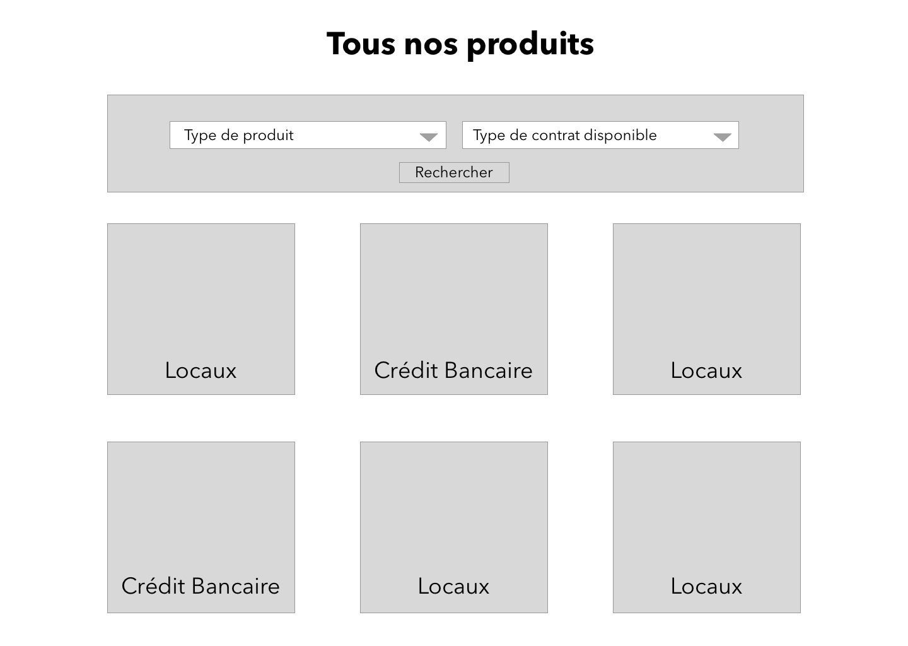
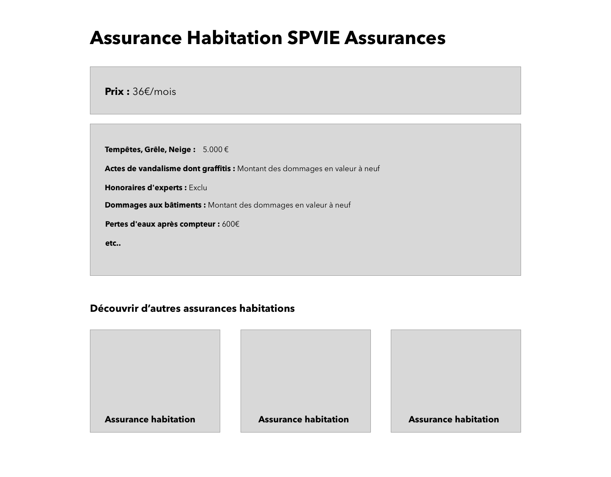

# RAILS Test Hoggo

## Énoncé

Tu dois développer une micro-application qui affiche des produits (Exemple : des locaux d'entreprises, des crédits bancaires) et leurs caractéristiques (la surface, le nombre de pièces, le taux, l'échéance etc.). Chaque produit a des caractéristiques qui peuvent être différentes d'un produit à l'autre. Ce même produit peut avoir 2 types de contrats différents : temporaire (avec une fin) / permanents (juste un début).

## Exemple Front : 

### Index d'un produit

### Show d'un produit

## Bonne Chance !
